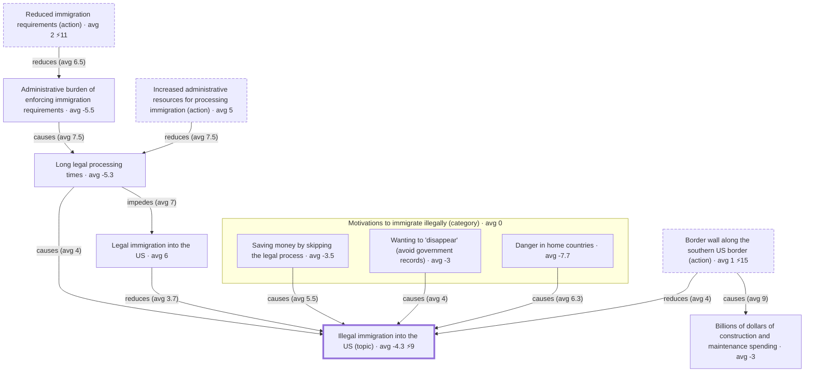
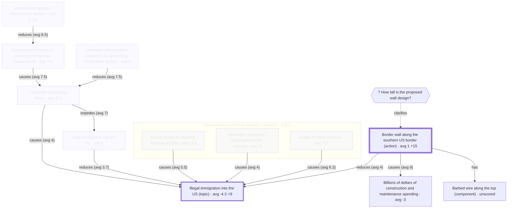

## What is this?

- UX design explorations for an app that implements the sibling [ontology](./ontology.md)
- The central design question so far: when a user goes to view a topic, what should be shown?
- Mockups are text-based so they're easy to diff and iterate on; they use the ontology's ["Build a wall" example](./ontology.md#Example) so that every screen shows real nodes/edges/scores
	- mockups are viewed as **danny**: experienced with the app, new to this topic, no scores on it yet
- Plan: once a few states stabilize, generate a clickable HTML wireframe from this spec to evaluate those; the spec stays the source of truth and the wireframe is regenerated from it, never hand-edited

## Design plan

- What we're leaning toward. Not fully settled, but this section isn't for deep debate: minor open points sit in **Question** subsections below their decision; major ones move to [Open design questions](#open-design-questions).

### Land on a generated topic brief, not the raw graph

- Don't land users solely on the raw graph - land them on a generated **topic brief** assembled from the ontology's own prioritization signals (topic node, guiding-question weights, score spread, unanswered questions)
	- everything in the brief is derived from structure + scores - no manual curation

### Two asymmetric panes (agenda / structure)

- Two panes with asymmetric jobs (avoid duplicate info between them):
	- **Agenda pane**: text; owns everything ranked, aggregated, and explained - answers "what should I look at and why"
	- **Structure pane**: diagram; owns relationships - answers "how does this fit together"
	- keep node visuals light (text, score fill, contested badge) - cramming ranked/aggregated info into the diagram is how graph UIs become unreadable

### Agenda pane is a master-detail stack

- The agenda pane is a master-detail stack: the brief is the root; clicking any node (in either pane) pushes a detail view with back navigation

### Structure pane hosts switchable views

- The structure pane isn't a single static diagram - it hosts a few generated views (causal map, tradeoffs table, claim tree) and switches between them
- switching views is an explicit user action - selection alone never swaps the view
- within a view, prefer spatial stability - selection should pan/highlight rather than re-layout; *how* to actually achieve it is a [top-level open question](#spatial-stability-how-to-achieve-it) with a lot to weigh

### Perspectives selector

- a Perspectives selector can switch to any subset of people (one person, a faction, everyone); aggregates recompute over the selected subset

### Layout

- Desktop: agenda pane = left half, structure pane = right half; selection syncs both ways
- Mobile: agenda pane by default; a button/slide reveals the structure pane
	- OK if the mobile diagram stays mediocre: mobile is for consuming/scoring/commenting (agenda-pane work); structural editing is desktop work

#### Question: does mobile's slide-over diagram get used?

- prototype would help feel out this question
- does the slide-over diagram get used at all, or is agenda-only the real mobile experience?

### Scope: new-to-topic users first

- New-to-topic users are the primary focus for now; new-to-app users can get a tutorial later (out of scope here)

## How to read this doc

- `/` lines are meta comments (same convention as the ontology example): they explain why an element is shown or ranked where it is (usually: which calculation drives it); they wouldn't render
- Flows are sequences of named states; each state after the first describes only its **delta** from the state it came from
- Interactions are written as: `[interaction] → State N`
- Agenda-pane mockups: nested markdown mirroring the UI hierarchy (nesting = containment, order = display order), with real content from the example
- Structure-pane mockups: a fenced mermaid diagram of what's visible, plus prose bullets for view type and behavior
	- / mermaid because it renders in GitHub/VSCode preview, so reviewers can process it visually; may switch to the ontology example's own (terser) syntax once the `to-mermaid` app supports it
	- / mermaid can't express deltas, so these blocks are always full renderings - the prose delta bullets remain the authoritative statement of what changed between states
	- / `%%` lines inside mermaid are meta comments (the equivalent of `/`)
- Score notation (semantics, not visual treatment - that's TBD):
	- `avg X` = mean across the perspectives that scored the thing
	- `⚡N` = contested indicator; N = spread (max minus min among scorers); shown when spread >= 8 (threshold TBD)

## UX flow mockups (desktop)

### Experienced user viewing a topic for the first time

#### State 1: initial view - the topic brief

##### Agenda pane (stack root: the topic brief)

- **Topic header**
	- `* Illegal immigration into the US` - avg -4.3 ⚡9
		- / the `#topic` node; contested because scores span -9..0
	- `[score this]` - prompt for danny to add their own change-importance score
- **The big question:** `? What are the most effective ways to reduce illegal immigration?`
	- / guiding questions ranked by avg `guides` weight to the topic; `best-ways` at guides[8,6,9] (avg 7.7) is the top root question, so it headlines
	- answered by a generated tradeoffs table:
	- / options are calculated (see ontology > Action > Notes): actions whose causal paths reduce the question's target
	- / "Inexpensive" cells come from causal-fulfils chains (e.g. the wall's cell = causes[9,9,9] x fulfils[-7,-8,-2]); `quick`/`humane` columns are empty because no fulfils edges exist yet - each empty cell is a visible contribution opportunity

	| option \ criterion | Inexpensive (importance avg 6) | Quick to implement (avg 5.3) | Humane treatment of immigrants (avg 6.7) |
	| --- | --- | --- | --- |
	| Border wall (avg 1 ⚡15) | avg -5.7 | – | – |
	| Increased admin resources (avg 5) | avg -3.5 | – | – |
	| Reduced immigration requirements (avg 2 ⚡11) | avg 6.5 | – | – |

- **Where people disagree**
	- / ranked by score spread across all scoreable things (nodes, claims, edges)
	1. `* Border wall along the southern US border` avg 1 ⚡15 - `[click] → State 2`
	2. `* Reduced immigration requirements` avg 2 ⚡11
	3. `= Most enter by crossing the border on foot between ports of entry` avg 2.7 ⚡11
	4. `= Most people who immigrate illegally are protecting themselves from danger` avg 4.7 ⚡11
	5. `= People will find a way over the barrier` avg 4 ⚡10
	- `[show more]`
		- / next up: `visa-overstay` ⚡10, the topic node ⚡9
	- / open question: rank purely by spread, or weight by centrality to the topic (a contested-but-peripheral thing matters less)?
- **Open questions**
	- / unanswered or contested questions; exact ranking TBD (guides/clarifies chain priority where scored, but `how-tall` is unscored)
	- `? How tall is the proposed wall design?` - no answers yet - `[answer]`
	- `? How do most people illegally enter the US?` - 2 answers, both contested ⚡
	- `? Why do people immigrate illegally?` - guiding; chained priority to the topic avg ~4.7 (guides[7,9,2] x guides[8,6,9]/9)
- **Explore the full map** - `[click] → structure pane shows unfiltered causal-map view`

##### Structure pane

- view type: **causal map** - concept nodes + causal edges only (claims, questions, criterion nodes, and fulfils/criterion-for edges hidden; those belong to other views)
	- / note `wall-cost` appears: it's a concept in the causal web, even though it exists mainly to feed the `inexpensive` criterion
- nothing selected yet → overview framing, topic node visually anchored
- nodes render: text, avg score fill, ⚡ badge if contested; edges render: type + avg weight
- components (`barbed-wire`) and clarifying questions (`how-tall`) are collapsed into their node by default

#### State 2: after clicking the `wall` disagreement entry

- transition: click entry 1 in **Where people disagree** (or the `wall` node in the structure pane) → this state

##### Agenda pane (delta: detail view pushed onto the stack)

- `[← back to brief]`
- **Node card**: `* Border wall along the southern US border` `#action`
	- scores: alice 2 · bob -7 · casey 8 (avg 1 ⚡15) · danny: `[score this]`
- **Why these scores?**
	- / arguments about the wall's change-importance score; calculated ones per ontology > Core features > Calculated arguments
	- / calculated arguments are perspective-relative (edge weights x the *viewer's* concept scores); danny has no scores yet, so group aggregates are used and labeled as such
	- toward a higher score:
		- reduces `* Illegal immigration into the US` (edge avg 4, node avg -4.3 ⚡9)
			- / calculated pro: reducing a negatively-scored thing; note it flips per person - for bob (node 0, edge 1) this argues ~nothing, which is presumably why they scored a -7
			- argued by 3 claims (1 supporting, 2 critiquing) - `[expand] → State 3 (claim tree)`
	- toward a lower score:
		- causes `* Billions of dollars of construction and maintenance spending` (edge avg 9, node avg -3)
			- / calculated con: causing a negatively-scored thing; nobody disputes the edge (causes[9,9,9])
	- / no manual claims target the wall's node score directly in this topic - all manual argument happens on the `wall-reduces` edge (State 3)
- **Components**: has `* Barbed wire along the top` (unscored)
- **Open questions here**: `? How tall is the proposed wall design?` - unanswered - `[answer]`

##### Structure pane (delta)

- stays in **causal map** view, same layout (spatial stability) - pans/zooms to `wall`, highlights it, dims non-neighbors in place
- `wall`'s collapsed detail expands in place: component `barbed-wire` and clarifying question `how-tall` appear attached to the node

#### Candidate next states (not yet specced)

- State 3: expand the claim thread on `wall-reduces` → structure pane switches to a **claim tree** view (first view-type switch; spec what that transition looks like)
- State 4: click **The big question** / the tradeoffs table → structure pane switches to a **tradeoffs table** view (or is the table agenda-pane-only?)
- State 5: danny submits their first scores → what changes? (e.g. a "you vs group" delta appears; calculated arguments re-derive from their perspective; prompt: "your reasoning isn't on the map yet - add it?")
- State 6: scoring-walkthrough onboarding variant (the brief presented section-by-section, scoring as you read; by the end the app knows where danny diverges and whether their reasons are already captured)

## Open design questions

- Bigger UX questions that likely need more than a small amount of debate and therefore would be too much for putting directly on the design plan.

### Score display at overview (no perspective selected)

- leaning: Option 3 (gradient) as the most promising; mockups use Option 1 (avg + ⚡) for now
- prototype would help feel out which treatment stays legible at the zoom levels a half-width pane forces

#### Notes

- whatever the treatment, ideally show the aggregate *and* contestedness
- all treatments color on a -9..9 scale; needs a colorblind-safe diverging palette, not red-green
- edges: a gradient along the stroke would read as direction/flow (source color → target color), so the distribution strip probably belongs on the edge's label chip (which already shows type + weight) - same visual language as nodes

#### Questions - Unanswered

- node visual treatment: are the score treatments (score fill, pie or gradient backgrounds/borders, ⚡ badge) legible at the zoom levels a half-width pane forces? is text readable on a banded background, or does the border variant win? (prototype)

#### Option 1: avg + ⚡ badge

- what is it
	- avg + ⚡ badge; what these mockups use

#### Option 2: pie-chart node background

- what is it
	- a slice per user's score
- good
	- shows distribution shape (e.g. bimodal vs uniform), not just spread

#### Option 3: gradient node background (or border)

- what is it
	- one equal-width band per scorer, sorted by score
- good
	- consensus renders as a near-solid color, disagreement as a visible sweep; the node itself shows the disagreement, so no number needed until selection reveals detail
	- likely beats pie for ordinal scores: it's a sorted strip (no order reconstruction), and it has no tiny wedges at small sizes
- notes
	- use hard stops between bands, not interpolation - interpolating invents middle colors nobody scored (e.g. wall's [-7,2,8] would sweep through muddy mid-tones); with many users the bands smooth out naturally
- questions
	- background vs border: background is more visible but puts text on multicolor; border keeps text clean but may vanish at overview zoom - prototype question

### Spatial stability: how to achieve it?

- leaning: layer Options 1-4 in that order, (they compose)
- prototype would help feel out what's ok

#### Notes

- hard because focusing filters many nodes in/out
- animating node movement can help a little bit but doesn't help with building a mental model

#### Questions - Unanswered

- is there some non-diagram format that we could keep around as a visual aid that is easier to keep stable than a diagram?
  - like Kialo's sunburst view, but with our node types (something like this https://www.figma.com/design/XqLnSqZrFxifevzznGgsKH/Focused-nodes-design?node-id=161-2&p=f&t=FRsDMDZLspne9eh0-0)

#### Option 1: static full layout, camera-only focus

- what is it
	- lay out the view's full node set once; focusing dims/hides nodes and moves the camera, but surviving nodes never move
- questions
  - how to make it easy to read the undimmed nodes without having to zoom in/out a lot?
    - mainly a concern when there are a lot of nodes showing, which seems like would be pretty often if we aren't filtering nodes out

#### Option 2: incremental layout (pin survivors)

- what is it
	- when revealing/hiding forces placement changes, pin the surviving nodes and only place the new ones (e.g. ELK's "interactive" mode)

### Disagreement metric & contested threshold

- is spread the right disagreement metric (vs variance, vs bimodality), and is >= 8 the right contested threshold?

### Rank "Where people disagree" by spread or centrality?

- should "Where people disagree" weight by centrality/importance to the topic rather than raw spread?

### Ranking "Open questions" (scored vs unscored)

- how should "Open questions" rank unscored questions (like `how-tall`) against scored ones?

### Degenerate topics with no brief spine

- degenerate topics: no `#topic` node, no guiding questions → the brief has no spine
- leaning: fall back to most-scored / most-connected nodes, plus a nudge to add a guiding question
	- also consider asking "what's the main question you're trying to answer?" during topic creation, so the degenerate case stays rare

### Pane balance: does the structure pane earn 50% width?

- prototype would help feel out this question
- does the structure pane earn a full 50% width, or should the agenda pane dominate with the diagram expanding on interaction?
	- key observation to make: do users ever *initiate* from the diagram, or is it a passive echo of agenda-pane selection?

