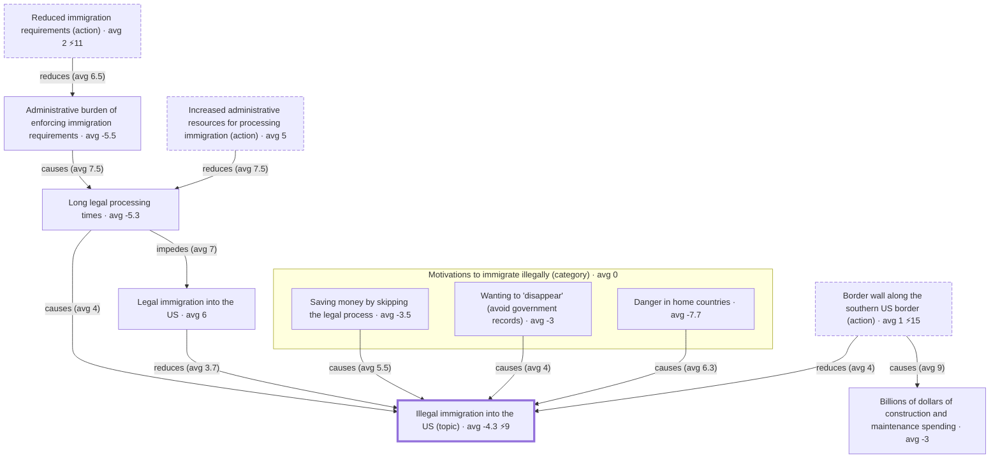
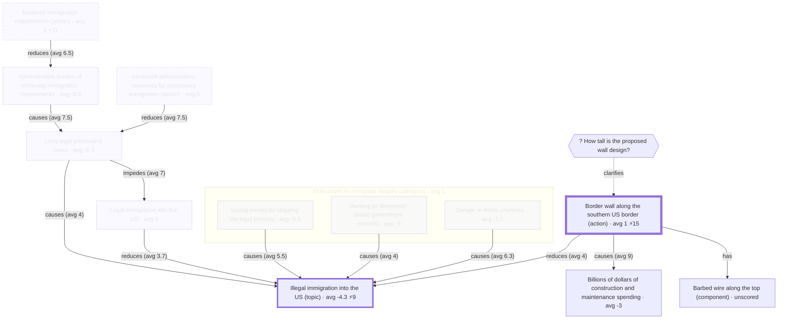

## What is this?

- UX design explorations for an app that implements the sibling [ontology](./ontology.md)
- Central design question: when a user goes to view a topic, what should be shown?
- Mockups are text-based so they're easy to diff and iterate on; they use the ontology's ["Build a wall" example](./ontology.md#Example) so that every screen shows real nodes/edges/scores
	- mockups are viewed as **danny**: experienced with the app, new to this topic, no scores on it yet
	- assumption: new-to-app users will get a tutorial of some kind
- Plan: once a few states stabilize, generate a clickable HTML wireframe from this spec to evaluate those; the spec stays the source of truth and the wireframe is regenerated from it, never hand-edited

## High-level UX ideas

- split panes: agenda pane on left, structure pane on right
  - panes stay in sync based on interactions made in the other pane
  - mobile might show just agenda pane, with swipe or button to get to the structure pane
    - mobile is just for consuming/scoring/commenting, desktop is better for editing structure
- perspectives selector can switch to any subset of people's scores (e.g. one person, a faction, everyone)
  - group scores are averaged but node/edge-label borders are gradient-colored to convey score distribution
    - option to show disagreement scores (standard deviation)

### Agenda pane

- text; owns everything ranked, aggregated, and explained - answers "what should I look at and why"
- initially: a **topic brief** assembled from the ontology's own prioritization signals (node types / relations / scores)
- master-detail stack: the brief is the root; clicking any node (in either pane) pushes a detail view with back/breadcrumb navigation

### Structure pane

- shows generally non-linear visuals (e.g. diagram/table) to help aid comprehension, answers "how does this fit together"
- keep node visuals light (text, score colors?)
- initially: show top scored nodes with relations between them

#### Questions

- [How to keep diagram from re-layouting too much?](#how-to-keep-diagram-from-re-layouting-too-much)

### Score-based node/edge-label border gradients

- what is it
	- one equal-width band per scorer, sorted by score
- good
  - conveys score distributions
	- consensus renders as a near-solid color, disagreement as a visible sweep
	- the node itself shows the disagreement, so no number needed until selection reveals detail
- notes
	- use hard stops between bands rather than a smooth gradient, to avoid suggesting in-between scores that don't exist
	- needs a colorblind-safe diverging palette, not red-green

## High-level UX flow

### State 1: Initial entry to topic

- Agenda pane
  - note: each section here sorts items by score, and "show more/less" if there are any to show/hide
  - note: all scores here should be scaled by distance to the topic node (see question in subsection for how)
	- "Topic": topic node and description (one topic node should be selected)
  	- "Guide me through the topic" (and ask me to score things)
	- "Hottest Details": top 5 of all nodes/edges excluding topic node (normalized scores, see question in subsection for how)
	- "Guiding Questions": top 5 guiding questions
  	- if structure editing + < 5 items: "add guiding question"
	- "Most important to change": top 5 (absolute value) concepts
	- "Disagreement": top 5 std-deviation causal concepts/edges
	- "Unknowns": top 5 unanswered clarifying questions
- Structure pane
  - probably just show top 10 important nodes to the Topic

#### Questions - unanswered

- should the topic brief convey the scores via more than just sorting the items top-to-bottom?
  - would be nice to show the scores colored with a pie-distribution background
    - might even be good to use the backgrounds or borders to gradient-color it
    - will have to see if these options make the visual too cluttered

#### Questions - kind of answered

- how to scale scores by distance to topic node?
  - concept scores: can be multiplied across the causal scores until the path reaches the topic node
  - "guides"/"clarifies" scores: multiply along path until reaching target concept node, then that node multiplies following "concept scores" strategy
  - [TODO: rest of score types]
  - how to do this for disagreement scores?
- how should "guide me through the topic" work?
  - maybe agenda pane shows the node/edge notes, comments, summary view aspects
	- maybe structure pane shows top 10 "important to this node" nodes? ("show more"?)
  	- maybe also the relation to the topic node and/or to the "important to topic node" nodes...?
  - since importance scores (concepts, questions) are relative, should we show the highest/lowest of each first (and keep them showing after)?
    - so that users can get a feel for the relativity
    - this seems possible in the agenda pane
- how to normalize scores?
  - normalize to 0..1
		- 0..8: divide by 8
		- -8..8: add 8, divide by 16
  - for aggregates (multiple perspectives scored + showing):
    - calculate normalized averages _and_ normalized _standard deviations_ - high deviation should normalize close to 1

#### Questions - answered

- how should "Open questions" rank unscored questions (like `how-tall`) against scored ones?
  - unscored questions can probably just use a default score of 4 (scale 0..8)

## UX flow example (desktop) [OUT OF DATE - IGNORE UNTIL "High-level UX flow" IS MORE SOLID!]

- `/` lines are meta comments: they explain why an element is shown or ranked where it is; they don't render
- Flows are sequences of named states; each state after the first describes only its **delta** from the state it came from
- Interactions are written as: `[interaction] → State N`
- Agenda-pane mockups: nested markdown mirroring the UI hierarchy (nesting = containment, order = display order), with real content from the "build a wall" example
- Structure-pane mockups: a fenced mermaid diagram of what's visible, plus prose bullets for view type and behavior
	- mermaid because it renders in GitHub/VSCode preview, so reviewers can process it visually
	- maybe switch to the ontology example's own (terser) syntax once the `to-mermaid` app supports it
	- mermaid can't express deltas, so these blocks are always full renderings
  	- the prose delta bullets remain the authoritative statement of what changed between states
- Score notation (semantics, not visual treatment - that's TBD):
	- `avg X` = mean across the perspectives that scored the thing
	- `⚡N` = contested indicator; N = spread (max minus min among scorers); written when spread >= 8

### Experienced user viewing a topic for the first time

#### State 1: initial view - the topic brief

##### Agenda pane (stack root: the topic brief)

- **Topic header**
	- `* Illegal immigration into the US` - avg -4.3 ⚡9
		- / the `#topic` node; contested because scores span -9..0
	- `[score this]` - prompt for danny to add their own change-importance score
- **The big question:** `? What are the most effective ways to reduce illegal immigration?`
	- / guiding questions ranked by avg `guides` weight to the topic; `best-ways` at guides[8,6,9] (avg 7.7) is the top root question, so it headlines
	- answered by a generated tradeoffs table:
	- / options are calculated (see ontology > Action > Notes): actions whose causal paths reduce the question's target
	- / "Inexpensive" cells come from causal-fulfils chains (e.g. the wall's cell = causes[9,9,9] x fulfils[-7,-8,-2]); `quick`/`humane` columns are empty because no fulfils edges exist yet - each empty cell is a visible contribution opportunity

	| option \ criterion | Inexpensive (importance avg 6) | Quick to implement (avg 5.3) | Humane treatment of immigrants (avg 6.7) |
	| --- | --- | --- | --- |
	| Border wall (avg 1 ⚡15) | avg -5.7 | – | – |
	| Increased admin resources (avg 5) | avg -3.5 | – | – |
	| Reduced immigration requirements (avg 2 ⚡11) | avg 6.5 | – | – |

- **Where people disagree**
	- / ranked by score spread across all scoreable things (nodes, claims, edges)
	1. `* Border wall along the southern US border` avg 1 ⚡15 - `[click] → State 2`
	2. `* Reduced immigration requirements` avg 2 ⚡11
	3. `= Most enter by crossing the border on foot between ports of entry` avg 2.7 ⚡11
	4. `= Most people who immigrate illegally are protecting themselves from danger` avg 4.7 ⚡11
	5. `= People will find a way over the barrier` avg 4 ⚡10
	- `[show more]`
		- / next up: `visa-overstay` ⚡10, the topic node ⚡9
	- / open question: rank purely by spread, or weight by centrality to the topic (a contested-but-peripheral thing matters less)?
- **Open questions**
	- / unanswered or contested questions; exact ranking TBD (guides/clarifies chain priority where scored, but `how-tall` is unscored)
	- `? How tall is the proposed wall design?` - no answers yet - `[answer]`
	- `? How do most people illegally enter the US?` - 2 answers, both contested ⚡
	- `? Why do people immigrate illegally?` - guiding; chained priority to the topic avg ~4.7 (guides[7,9,2] x guides[8,6,9]/9)
- **Explore the full map** - `[click] → structure pane shows unfiltered causal-map view`

##### Structure pane

- view type: **causal map** - concept nodes + causal edges only (claims, questions, criterion nodes, and fulfils/criterion-for edges hidden; those belong to other views)
	- / note `wall-cost` appears: it's a concept in the causal web, even though it exists mainly to feed the `inexpensive` criterion
- nothing selected yet → overview framing, topic node visually anchored
- nodes render: text, avg score fill, ⚡ badge if contested; edges render: type + avg weight
- components (`barbed-wire`) and clarifying questions (`how-tall`) are collapsed into their node by default

#### State 2: after clicking the `wall` disagreement entry

- transition: click entry 1 in **Where people disagree** (or the `wall` node in the structure pane) → this state

##### Agenda pane (delta: detail view pushed onto the stack)

- `[← back to brief]`
- **Node card**: `* Border wall along the southern US border` `#action`
	- scores: alice 2 · bob -7 · casey 8 (avg 1 ⚡15) · danny: `[score this]`
- **Why these scores?**
	- / arguments about the wall's change-importance score; calculated ones per ontology > Core features > Calculated arguments
	- / calculated arguments are perspective-relative (edge weights x the *viewer's* concept scores); danny has no scores yet, so group aggregates are used and labeled as such
	- toward a higher score:
		- reduces `* Illegal immigration into the US` (edge avg 4, node avg -4.3 ⚡9)
			- / calculated pro: reducing a negatively-scored thing; note it flips per person - for bob (node 0, edge 1) this argues ~nothing, which is presumably why they scored a -7
			- argued by 3 claims (1 supporting, 2 critiquing) - `[expand] → State 3 (claim tree)`
	- toward a lower score:
		- causes `* Billions of dollars of construction and maintenance spending` (edge avg 9, node avg -3)
			- / calculated con: causing a negatively-scored thing; nobody disputes the edge (causes[9,9,9])
	- / no manual claims target the wall's node score directly in this topic - all manual argument happens on the `wall-reduces` edge (State 3)
- **Components**: has `* Barbed wire along the top` (unscored)
- **Open questions here**: `? How tall is the proposed wall design?` - unanswered - `[answer]`

##### Structure pane (delta)

- stays in **causal map** view, same layout (spatial stability) - pans/zooms to `wall`, highlights it, dims non-neighbors in place
- `wall`'s collapsed detail expands in place: component `barbed-wire` and clarifying question `how-tall` appear attached to the node

#### Candidate next states (not yet specced)

- State 3: expand the claim thread on `wall-reduces` → structure pane switches to a **claim tree** view (first view-type switch; spec what that transition looks like)
- State 4: click **The big question** / the tradeoffs table → structure pane switches to a **tradeoffs table** view (or is the table agenda-pane-only?)
- State 5: danny submits their first scores → what changes? (e.g. a "you vs group" delta appears; calculated arguments re-derive from their perspective; prompt: "your reasoning isn't on the map yet - add it?")
- State 6: scoring-walkthrough onboarding variant (the brief presented section-by-section, scoring as you read; by the end the app knows where danny diverges and whether their reasons are already captured)

## Big open questions

### There are a lot of calculations that multiply scores across paths - how to keep this performant?

- not sure if there will be performance issues here
- math is usually pretty performant but it seems like a lot of calculations need to be made
  - there must be a way to effectively cache/reuse calculations, since many calculations are similar / across same paths

### How to keep diagram from re-layouting too much?

- leaning: ?

#### Notes

- hard because focusing filters many nodes in/out
- animating node movement can help a little bit but doesn't help with building a mental model

#### Questions - Unanswered

- is there some non-diagram format that we could keep around as a visual aid that is easier to keep stable than a diagram?
  - like Kialo's sunburst view, but with our node types (something like this https://www.figma.com/design/XqLnSqZrFxifevzznGgsKH/Focused-nodes-design?node-id=161-2&p=f&t=FRsDMDZLspne9eh0-0)

#### Option 1: static full layout, camera-only focus

- what is it
	- lay out the view's full node set once; focusing dims/hides nodes and moves the camera, but surviving nodes never move
- questions
  - how to make it easy to read the undimmed nodes without having to zoom in/out a lot?
    - mainly a concern when there are a lot of nodes showing, which seems like would be pretty often if we aren't filtering nodes out

#### Option 2: incremental layout (pin survivors)

- what is it
	- when revealing/hiding forces placement changes, pin the surviving nodes and only place the new ones (e.g. ELK's "interactive" mode)
